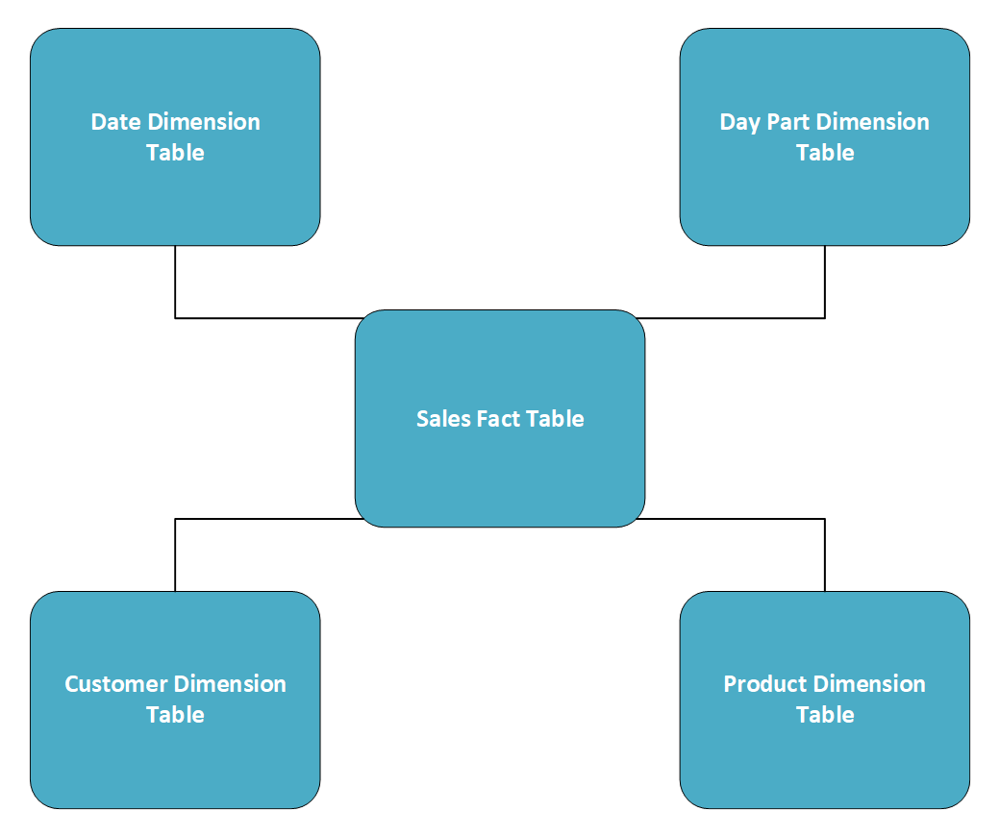
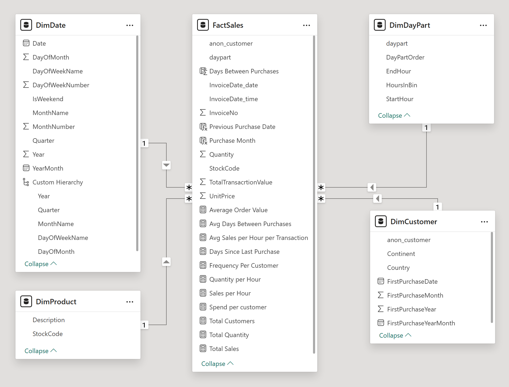
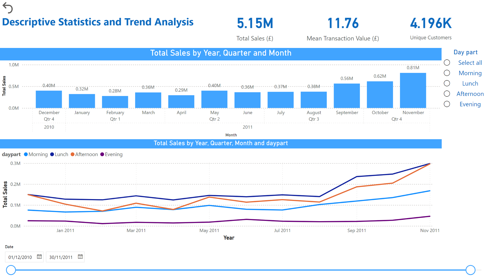
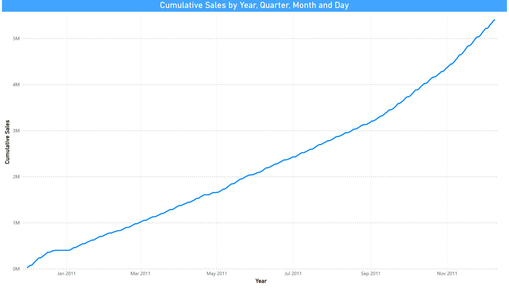
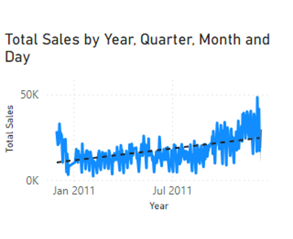
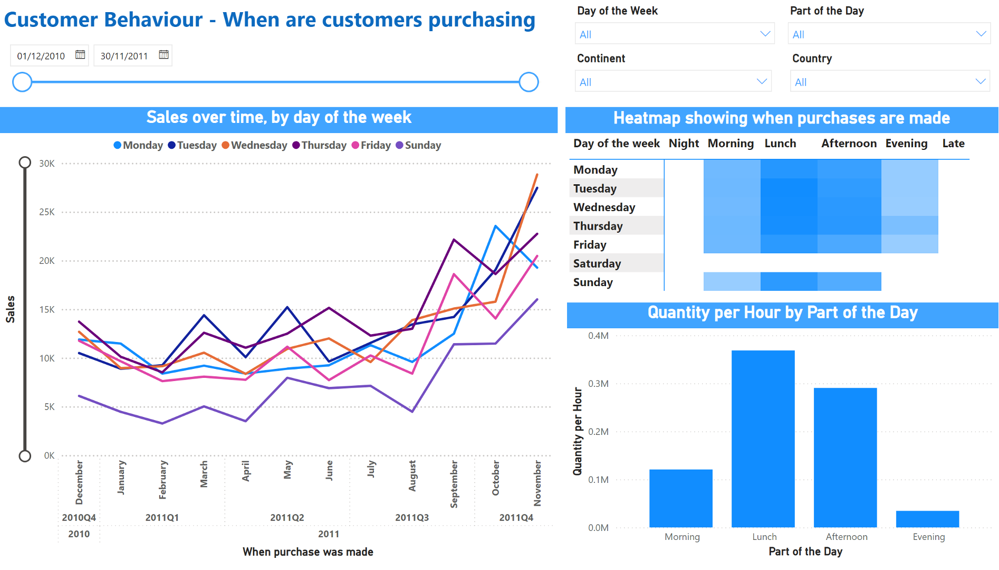
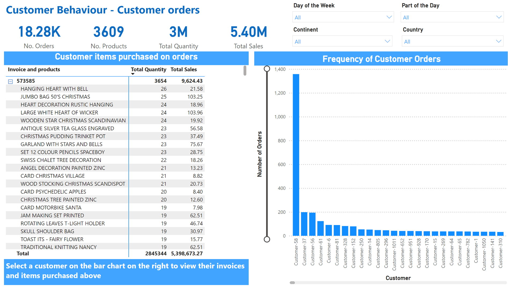
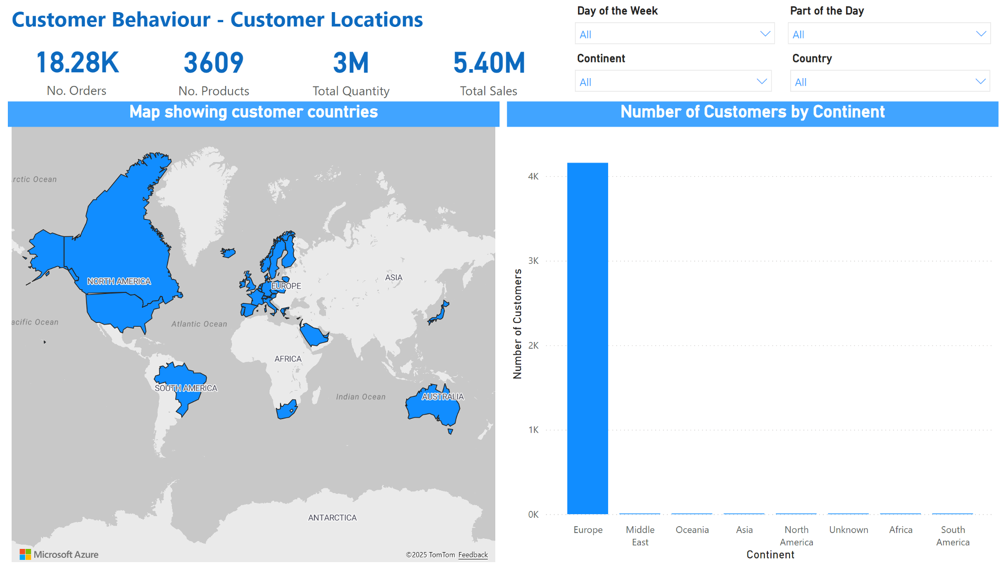
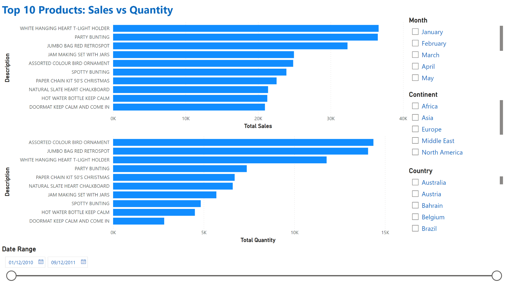
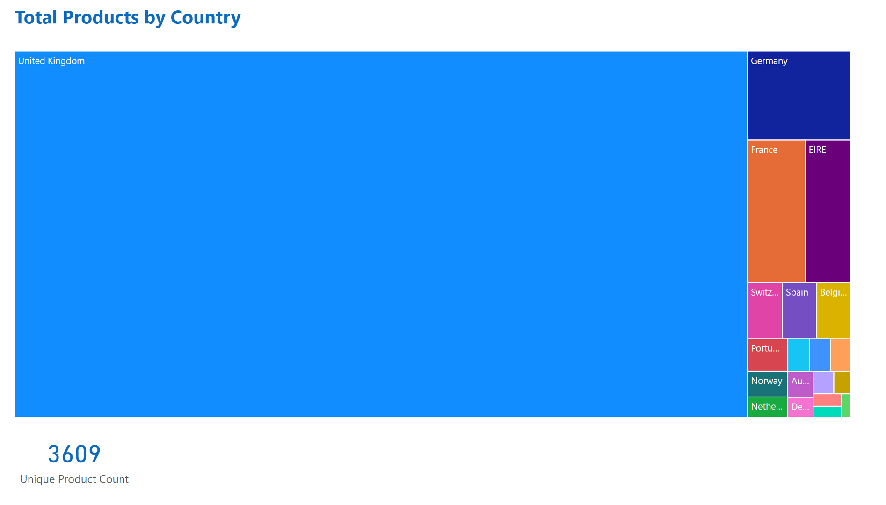

<p align="center">
 
 <h1 align="center">Online Retail Transaction Analysis</h1>
 <p align="center">Analysing data and producing PowerBI dashboard visualisations</p>
</p>

<p align="center">
  <br/>
  <a href="https://www.python.org/" title="Python official website">
    
  </a>
  <a href="https://pandas.pydata.org/" title="Pandas official wesbite">
    
  </a>
   <a href="https://matplotlib.org/stable/" title="Matplotlib offical website">
    
  </a>
  <a href="https://seaborn.pydata.org/" title="Seaborn offical website">
    
  </a>
  <a href="https://www.microsoft.com/en-us/power-platform/products/power-bi" title="PowerBI offical website">
    
  </a>
  <a href="https://www.kaggle.com/" title="Kaggle offical website">
    
  </a>
  <br />
</p>

<p align="center">
  <a href="https://github.com/users/BethW83/projects/3">Project Board</a>
  &nbsp;&nbsp;-&nbsp;&nbsp;
  <a href="./jupyter_notebooks/data_clean_EDA.ipynb">Data Cleanup & EDA</a>
  &nbsp;&nbsp;-&nbsp;&nbsp;
  <a href="#conclusions">Conclusions</a>
 &nbsp;&nbsp;-&nbsp;&nbsp;
  <a href="#1-descriptive-statistics-and-trend-analysis">Dashboards</a>
  <br/><br/><br/>
</p>

<details>
<summary>Table of contents (Click to show)</summary>

-   [Dataset Content](#dataset-content)
-   [Business Requirements](#business-requirements)
-   [Hypothesis](#hypothesis)
-   [Project Plan](#project-plan)
-   [The rationale to map the business requirements to the Data Visualisations](#the-rationale-to-map-the-business-requirements-to-the-data-visualisations)
-   [Analysis techniques used](#analysis-techniques-used)
-   [Ethical considerations](#ethical-considerations)
-   [Dashboard Design](#dashboard-design)
-   [Conclusions](#conclusions)
-   [Unfixed Bugs](#unfixed-bugs)
-   [Development Roadmap](#development-roadmap)
-   [Main Data Analysis Libraries](#main-data-analysis-libraries)
-   [Credits](#credits)
    -   [Content](#content)
    -   [Media](#media)
-   [Acknowledgements](#acknowledgements)

</details>

<p>

</p>

<details>
<summary>How to use this repo (Click to show)</summary>

**Make sure you have:**

-   Python installed, this project used V3.12,
-   VS Code latest

**Inside VS Code:**

Open Extensions (Ctrl+Shift+X or ⇧⌘X on macOS)
Install these extensions if you don't have them:

-   Python extension (by Microsoft in the Extensions Marketplace)
-   Jupyter extension (also by Microsoft)

**From the terminal:**

Open the folder in a terminal where you want the project to be saved

#### Run git clone:

```
git clone https://github.com/BethW83/Group-Project-1-Retail.git
```

#### Navigate in to the new folder:

```
cd Group-Project-1-Retail
```

#### Setup a virtual environment:

Create a virtual environment for the project.

Linux / Mac:

```
python3 -m venv .venv
source .venv/bin/activate
```

Windows CMD:

```
python3 -m venv .venv
.venv\Scripts\activate
```

Windows PowerShell:

```
python3 -m venv .venv
.\.venv\Scripts\Activate.ps1
```

#### Install the dependencies:

This will install all the dependencies needed for the project in to the virtual environment if it is setup, rather than globally

```
pip install -r requirements.txt
```

#### Select the Kernel

There is a drop down at the top of the notebooks to select your kernel that will run the Python.
If you setup a virtual environment then make sure you pick the venv one.

---

</details>

<p>
<br/>
</p>

**Online Retail Transaction Analysis** is a comprehensive data analysis tool to provide insights through interactive dashboards: to analyse customer behaviour, optimise pricing and marketing strategies and identify popular products.

Team Members:

-   Beth Williams
-   Pete Smith
-   Tom Burgess

# 

## Dataset Content

The dataset contains information on customer transactions made through an online retail platform. It includes the following columns:

-   `InvoiceNo:` - Transaction number
-   `StockCode:` - Product number
-   `Description:` - Product name
-   `Quantity:` - Quantity sold (negative for cancelled orders)
-   `InvoiceDate:` - Date and time of transaction
-   `UnitPrice:` - Price of one unit of the item
-   `CustomerID:` - Unique customer identifier
-   `Country:` - Customer location

## Business Requirements

Analyse online retail transaction data to understand customer behaviour, identify popular products, and optimise pricing and marketing strategies. Develop interactive dashboards to provide insights into customer behaviour, popular products, and pricing strategies to improve sales and marketing efforts.

## Hypothesis

-   There is an increase in sales during December i.e. for Christmas and November i.e. for Black Friday
-   Majority of the orders are made at lunch time
-   Sunday has less orders than the rest of the week
-   Majority of the orders are made by UK customers
-   Customers make return and make multiple orders
-   A small number of products account for the largest sales and quantities sold.

## Project Plan

The project follows the following steps:

1. `Extract` - Extract the data from Kaggle.
2. `Load` - Load the CSV via Pandas.
3. `Transform` - Clean and process the data using Pandas, adding new columns and checking for missing or duplicated values.
4. `Visualise` - Creating charts with Matplotlib and Seaborn to visualise the data and check for outliers.
5. `Dashboard` - Create a Power BI dashboard to interrogate the data.
6. `Analyse` - Interpret what the dashboard visualisations displayed.
7. `Document` - Record findings and conclusions.

## The rationale to map the business requirements to the Data Visualisations

-   Seasonal increase in sales
    -   Observing and understanding sales trends allows a company to monitor growth as well as changes in market and customer behaviour over time. It allows the company to forecast sales and provides the marketing team with insight on when to focus marketing campaigns. It also allows the company to look to the past and benchmark their progress over time.
    -   Bar chart to show sales over time, with capability to drill down into different time periods
    -   Line chart to show cumulative sales over time
-   Majority of the orders are made at lunch time
    -   Use a heatmap showing weekdays against time of day to show the distribution of ordering time.
    -   Use a bar chart to visualise the frequency for each time of day.
-   Sunday has less orders than the rest of the week
    -   Use a line chart showing the orders for each day of the week.
-   Majority of the orders are made by UK customers
    -   Add filters across the dashboard to allow filtering on country and continent.
    -   Use a visual map to display the customers location.
-   Customers make return visits and make multiple orders
    -   Use a bar chart to show the frequency of orders grouped by customer.

-   Products Analysis: 
    -   Page 1: Display the top 10 products in bar charts by total sales and by total quantities. 
    -   Use filters to enable the following options to be  chosen: date range, month, continent and country. 
    -   Use tooltips to provide further information. 
    -   Page 2: Display the product quantities sold by country using a treemap. 
    -   Use a tooltip to show total sales when hovering over the country. 


## Analysis techniques used

1. Methods Used:

    - Descriptive statistics (`.describe()`, `.info()` etc.)

    - Segmentation (used bins for day parts)

    - Visual analytics (`Matplotlib`, `Seaborn`, `Power BI`)

2. Limitations & Alternatives:

    - Limited data points available in the csv, especially with the product data, it only had product code and description which limited how we could report on products.
    - There was no data for Saturdays.
    - There was no cost price so we couldn't report on margins etc.

3. Structure Justification:

    - Data clean up and transform notebook as the first part.
    - Created a shared published Source Data in star diagram format.
    - Created a Power BI dashboard visualisation file for each team member, pulling from the single shared source data.

4. Use of Generative AI:

    - AI supported: GitHub copilot extension was installed and so did speed up some repetitive tasks.

## Ethical considerations

-   The Customer ID was anonymised. Even though it was only an ID number, we decided that was still traceable back to the individual if we had access to the rest of the companies data.

## Dashboard Design

After the data clean up, we exported five CSV files via Python to be imported in to Power BI which are setup as a star data structure:

<p align="center">

</p>

In the `/visualisations` folder we created four Power BI Desktop files:

-   `SharedDataset.pbix` - This is the file that imports the CSV files. As all team members folder location is different on their local development, we import the CSV files from this GitHub repository raw links using the Web import rather than the File import. This allows all team members to open and edit the file without modifying each time. All extra columns and measures were added to this file, then the data published to our shared Power BI workspace. The other three files then directly connect to this published dataset, so there is a single source of truth for the data that we all shared. We could then individually work on the following dashboard files separately without conflicts, while still publishing the dashboards to the same shared workspace.
-   `1-Descriptive-Statistics-and-Trend-Analysis.pbix` - This is the visualisations for the sales and descriptive statistics dashboard.
-   `2-Customer-Segmentation-and-Purchase-Behaviour.pbix` - This is the visualisations for the customer behaviour dashboard.
-   `3-Product-Analysis.pbix` - This is the visualisations for the product dashboard.

**DAX Measures and Columns**

We added a number of different measures to the SharedDataset Power BI file that we used in different visualisations:

-   Average Order Value - total sales divided by the number of orders:

```
Average Order Value =
DIVIDE([Total Sales], DISTINCTCOUNT(FactSales[InvoiceNo]))
```

-   Avg Days Between Purchases - Average of the days between purchases measure

```
Avg Days Between Purchases =
AVERAGE(FactSales[Days Between Purchases])
```

-   Avg Sales per Hour per Transaction - Sales per hour measure divided by the number of orders

```
Avg Sales per Hour per Transaction =
DIVIDE(
    [Sales per Hour],
    DISTINCTCOUNT(FactSales[InvoiceNo])
)
```

-   Days Between Purchases - column added that is the number of days between the invoice date and the previous purchase date:

```
Days Between Purchases =
DATEDIFF([Previous Purchase Date], FactSales[InvoiceDate_date], DAY)
```

-   Days Since Last Purchase - number of days since last purchase, counted up until the end of the data set (as the data is over a decade old, not capping at the end of the data set resulted in very large numbers for all records):

```
Days Since Last Purchase =
VAR LastPurchaseDate =
    CALCULATE(
        MAX(FactSales[InvoiceDate_date]),
        ALLEXCEPT(FactSales, DimCustomer[anon_customer])
    )

VAR DataEndDate =
    CALCULATE(
        MAX(FactSales[InvoiceDate_date]),
        ALL(FactSales)
    )

RETURN
DATEDIFF(LastPurchaseDate, DataEndDate, DAY)
```

-   Frequency per Customer - The number of orders for a cusomter:

```
Frequency Per Customer =
CALCULATE(
    DISTINCTCOUNT(FactSales[InvoiceNo]),
    ALLEXCEPT(DimCustomer, DimCustomer[anon_customer])
)
```

-   Previous Purchase Date - get the most recent order date before this order:

```
Previous Purchase Date =
VAR CurrentCustomer = FactSales[anon_customer]
VAR CurrentDate = FactSales[InvoiceDate_date]
RETURN
CALCULATE(
    MAX(FactSales[InvoiceDate_date]),
    FILTER(
        FactSales,
        FactSales[anon_customer] = CurrentCustomer &&
        FactSales[InvoiceDate_date] < CurrentDate
    )
)
```

-   Quantity per Hour - as all day part bins vary in size, we divide by the bin size to give a per hour value so they can be compared:

```
Quantity per Hour =
DIVIDE(
    SUM(FactSales[Quantity]),
    MAX(DimDayPart[HoursInBin])
)
```

-   Sales per Hour - Same as above but for the sales per hour:

```
Sales per Hour =
DIVIDE(
    SUM(FactSales[TotalTransacrtionValue]),
    MAX(DimDayPart[HoursInBin])
)
```

-   Spend per Customer - total cost per customer:

```
Spend per customer =
CALCULATE(
    SUM(FactSales[TotalTransacrtionValue]),
    ALLEXCEPT(DimCustomer, DimCustomer[anon_customer])
)
```

-   Total Customers - number of distinct customers:

```
Total Customers =
DISTINCTCOUNT(FactSales[anon_customer])
```

-   Total Quantity - Sum of the quanitity value:

```
Total Quantity =
SUM(FactSales[Quantity])
```

-   Total Sales - Sum of the total transaction value:

```
Total Sales =
SUM(FactSales[TotalTransacrtionValue])
```

Once imported, it looked like:


### **1 Descriptive Statistics and Trend Analysis**

- [Interactive dashboard link](https://app.powerbi.com/links/Zlk3rGdOeb?ctid=c233c072-135b-431d-af59-35e05babf941&pbi_source=linkShare) - This links only available to Code Institute users, and isn't publically shareable.

- [Link to a PDF of the dashboard](./visualisations/pdfs/1-Descriptive-Statistics-and-Trend-Analysis.pdf)

- <a href="https://screen.studio/share/0a7Dli0d" target="_blank" rel="noopener noreferrer">Dashboard Walkthrough Video</a>

**Descriptive Statistics Trend Analysis page:**



**Cumulative Sales Over Time page:**



**Sales Dynamic Tooltip page:** - This is used as the tooltip on the Descriptive Statistics Trend Analysis page and isnt intended to be viewed as a standalone page.



### **2 Customer Segmentation and Purchase Behaviour**

-   [Interactive dashboard link](https://app.powerbi.com/links/sx0ue_oPtW?ctid=c233c072-135b-431d-af59-35e05babf941&pbi_source=linkShare) - This links only available to Code Institute users, and isn't publically shareable.

-   [Link to a PDF of the dashboard](./visualisations/pdfs/2-Customer-Segmentation-and-Purchase-Behaviour.pdf)

-   <a href="https://screen.studio/share/1OGghJFI" target="_blank" rel="noopener noreferrer">Dashboard Walkthrough Video</a>

**When are customers purchasing page:**



**Customer orders page:**



**Where are customers based page:**



### **3 Product Analysis**

- [Interactive dashboard link](https://app.powerbi.com/links/NW76oemTmE?ctid=c233c072-135b-431d-af59-35e05babf941&pbi_source=linkShare) - This links only available to Code Institute users, and isn't publically shareable.

- [Link to a PDF of the dashboard](./visualisations/pdfs/3-Product-Analysis.pdf)

- <a href="https://screen.studio/share/e0O6KZzb" target="_blank" rel="noopener noreferrer">Dashboard Walkthrough Video</a>

**Top 10 Products page:**



**Products by Country page:**




## Conclusions

-   Seasonal increase in sales
    -   Looking at the graph of sales per month you can see an initial decrease from December 2010 where total sales were £0.4M to a low in February of £0.28M. There are two more small peaks in sales in March of £0.36M and up to £0.4M in May. Sales remain steady in the summer before a significant increase to £0.56M in September and another increase to £0.81M in November.
    -   To fully assess whether there are peaks in sales during November and December we would need to consider a larger dataset which includes data from multiple years. At the moment it is hard to tell if the increase in sales in November is seasonal or just represents an increase in sales on this website in general.
-   Majority of the orders are made at lunch time
    -   The majority of orders were made on Tuesday, Wednesday and Thursday lunch times. Even on the other days, the lunch time period was the busiest time for that day.
-   Sunday has less orders than the rest of the week
    -   Sunday had no orders made in the Evening period, and consistently tracked lower across the the date range compared to the other days.
-   Majority of the orders are made by UK customers
    -   16,585 of the 18,183 orders (91.21%) of orders were to UK based customers.
-   Customers make return and make multiple orders
    -   One customer made 1,358 separate orders with an average return days between purchases of 1.4 days. There were 3 other customers with over 100 orders and another 28 with over 30 orders. When you look at some of the customers with higher return rate, and what they purchase, it very much looks like they are buying products as a wholesaler rather than as an individual. As a future enhancement it would be useful to try and categorise customers in to wholesale and individuals to see how their buying patterns differ.

-   Product Analysis: 
    -   The filters to the right of the dashboard can be used to show the top 10 products per month. This provides insights into the type of products purchased seasonally. For example bunting is popular in the summer months and as the weather cools more night lights and hot water bottles are sold.
    -   There are 3609 unique products (by stock code), with the bottom 5 products only selling once.
    -   The date range can be set to go up to and including 30/11/2011 to ensure that one year’s data is showing (to avoid two Decembers, where the second December only has data for 8 days).
    -   It is immediately clear that the majority of the sales come from the UK. The second dashboard shows the top 20 countries for the quantity of products, with the remaining 18 countries making up the rest of the stock sold. 


TODO: Give an overall summary here too

## Unfixed Bugs

-   TotalTransacrtionValue - This is a spelling mistake, we have opted not to change it as all our dashboards are built and it could break the world!
-   The tooltip on the Azure map component doesn't round the tooltip values like the other charts do.
-   In Power BI on the second page of the Product Analysis the card for the total number of unique products doesn’t update when the countries are clicked on. This might be to do with the relationships between the tables. 

## Development Roadmap

Challenges faced:

-   Power BI stores absolute file paths when importing CSV files which makes it challenging when we all have different environments and both PC and MAC. We overcame this by making a single source dataset, connected it via the Web import instead of the File import, using the GitHub raw file links for the CSV files, and then made a single source data Power BI file, published the dataset, and then connected our own copies of a Power BI desktop file to the remote dataset. This enabled all team members to work on dashboards separately but still publish them to the same shared workspace.
-   The main map visualisation options in Power BI were not enabled for our organisation, so we used the Azure map visualisation option instead for mapping.
-   Initially the order of the day parts in the visualisations were not in the correct order, showing lunch, then evening and then morning. We over came this by adding an extra sort column to the day part table and sorting the daypart field by this new order column.
-   We had a few issues with Git getting out of sync and not allowing a team member to switch branch or merge from main. We overcame this as a team, sharing screens and helping each other through the process.
-   There was no data recorded at all for Saturday.
-   The last month of the data was only a few days in December 2011, so the charts all dipped down at the end when reporting by month as it didn't have a comparable full month of data. We added date sliders to allow users to easily exclude the end few days if required.

Next steps:

-   We decided to drop the cancelled invoices that were marked with a C. We would look to import these as a new fact table and create visualisations for these and analyse the data.
-   Look at replicating the dashboards in Tableau, and create a Streamlit Python interactive dashboard to widen our dashboarding knowledge.
-   Implement RFM (Recency, Frequency and Monetary) analysis to categorise customers based on their purchasing behaviour.
-   Investigate products that are frequently bought together, to enable the marketing team to implement product recommendations for products other customers also bought when items are added to basket.

## Main Data Analysis Libraries

-   `Pandas` - For cleaning the data and EDA.
-   `Seaborn` - For visualising the data in the Jupyter Notebook.
-   `Matplotlib` - For formatting the Seaborn charts and adding titles and labels.
-   `Power BI` - For creating the interactive dashboards.

## Credits

### Content

-   [Code institute](https://codeinstitute.net/) - The initial project structure.
-   [Kaggle](https://www.kaggle.com/) - Providing the data set used.
-   [Machine Learning Repository](https://archive.ics.uci.edu/dataset/352/online+retail) - More info on the dataset that explained the 'C' - Cancelled invoices.
-   [ChatGPT](https://chatgpt.com/) - Help overcoming Git issues.
-   [SimpleSteps.guide](https://simplesteps.guide/guides/technology/machine-learning-ai) - Notes recorded from the Code Institute course.

### Media

-   [Code Institute](https://codeinstitute.net/) - Code Institute logo.
-   [Python](https://www.python.org/) - Python logo image.
-   [Pandas](https://pandas.pydata.org/) - Pandas logo image.
-   [Matplotlib](https://matplotlib.org/) - Matplotlib logo image.
-   [Seaborn](https://seaborn.pydata.org/) - Seaborn logo image.
-   [Power BI](https://app.powerbi.com/) - Power BI logo image.
-   [Kaggle](https://www.kaggle.com/) - Kaggle logo image.

## Acknowledgements

-   Thank you to our tutor Emma Lamont and data coaches Spencer Bariball and Mark Briscoe for their ongoing help and support. Thank you also to our fellow bootcampers for their ongoing help and support.
